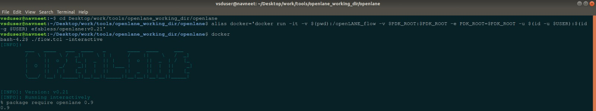
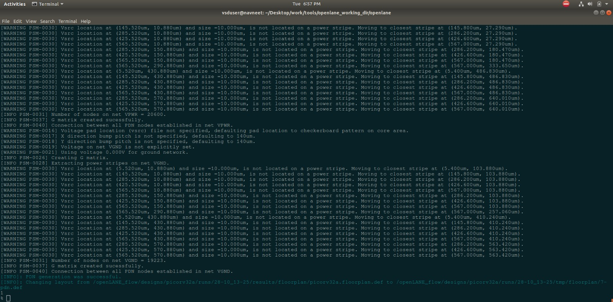
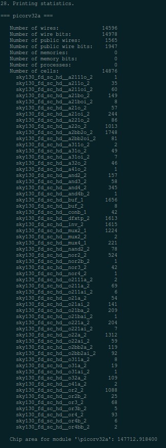

# Day 1 – Inception of Open-Source EDA, OpenLANE, and Sky130 PDK

## Theory

### How to Talk to Computers
**Concept:**  
Explains abstraction layers: ideas → algorithms → high-level code → assembly → machine code → hardware.  
In ASICs: algorithm → RTL → synthesis → gates → layout → silicon.  
**Why it matters:** Designers must write RTL that balances functionality with physical constraints (timing, area, power).  
**Practical notes:** Show how a C loop maps to RTL and affects gate-level timing.

---

### Introduction to QFN-48 Package, Chip, Pads, Core, Die, and IPs
**Concept:**  
Distinguishes **package** vs **die** vs **chip**. The die is silicon; the chip is the packaged version.  
**Pads** = I/O connections; **core** = logic area; **IPs** = pre-designed functional blocks.  
**Why it matters:** Packaging impacts I/O count, thermal design, and PCB integration.  
**Practical notes:** Display die floorplan with pad ring and note QFN thermal pad considerations.

---

### Introduction to RISC-V
**Concept:**  
Open, modular ISA (RV32I/RV64I with optional extensions) for CPUs and SoCs.  
**Why it matters:** Promotes open research and innovation in processor design.  
**Practical notes:** Cover toolchains (GCC/LLVM), simulators (Spike, QEMU), and SoC projects (Shakti, Rocket, PicoRV32).

---

### From Software Applications to Hardware
**Concept:**  
How software functionality is partitioned into hardware and software — deciding which parts become accelerators.  
**Why it matters:** Optimizes SoC performance, latency, and power.  
**Practical notes:** Example — profiling an FFT/encryption algorithm → RTL accelerator → SoC integration.

---

### SoC Design and OpenLANE (Overview & Flow)
**Concept:**  
Introduces open-source ASIC components — RTL, synthesis (Yosys), libraries (.lib, LEF), placement, routing, DRC/LVS, and STA.  
**Why it matters:** Each file type and stage connects logically in the design pipeline.  
**Practical notes:** Maintain organized directories for src/, synth/, layout/, reports/.

---

### Simplified RTL-to-GDSII Flow
**Concept:**  
Main stages: RTL → synthesis → netlist → floorplan → placement → CTS → routing → extraction → LVS/STA → GDSII.  
**Why it matters:** Clarifies data flow between DEF/LEF and timing closure iterations.  
**Practical notes:** Emphasize iterative nature of timing and congestion fixes.

---

### Introduction to OpenLANE and Strive Chipsets
**Concept:**  
OpenLANE automates RTL-to-GDS using OpenROAD and other tools. Strive serves as an example reference SoC.  
**Why it matters:** Reduces manual effort and standardizes flow setup.  
**Practical notes:** Explore flow.tcl, design configs, and run directory hierarchy.

---

### Introduction to OpenLANE Detailed ASIC Design Flow
**Concept:**  
Breakdown of OpenLANE steps — synthesis, floorplan, placement, CTS, routing, optimization, and signoff.  
**Why it matters:** Understanding each step helps debug and tune flow performance.  
**Practical notes:** Modify configs for clocks, SDC constraints, and library settings.

---

### Familiarization with Open-Source EDA Tools & Project Structure
**Concept:**  
Directory overview — flow/, designs/, pdks/, runs/, configs/.  
**Why it matters:** Knowing file locations is key for debugging and analysis.  
**Practical notes:** Identify outputs like final.gds, post_route timing reports, and extracted SPEF.

---

### Design Preparation Step
**Concept:**  
Pre-run checks — lint RTL, define clocks (SDC), verify IP LEFs, prepare config.tcl, and ensure library consistency.  
**Why it matters:** Prevents synthesis or floorplan errors.  
**Practical notes:** Checklist includes pin mapping, area definition, and power rail verification.

---

### Review Files After Design Prep and Run Synthesis
**Concept:**  
Check synthesized netlist, reports, timing, and area.  
**Why it matters:** Ensures RTL correctly maps to gates before physical stages.  
**Practical notes:** Review synth.v and timing reports for unsupported constructs.

---

### Steps to Characterize Synthesis Results
**Concept:**  
Analyze area, timing, utilization, and register counts.  
**Why it matters:** Guides optimization for performance or area.  
**Practical notes:** Evaluate total cell area, critical path delay, and Fmax estimates.

---

## Labs

<details>
    <summary>Setting up OpenLane</summary>
    
    Step 1: Download Required Files
        Download the OpenLANE VDI file from the link below:
        https://vsd-labs.sgp1.cdn.digitaloceanspaces.com/vsd-labs/openlane.zip

    Step 2: Extract the Downloaded File
        Unzip the downloaded openlane.zip file to extract the .vdi (Virtual Disk Image) file.

    Step 3: Resize the openlane.vdi File
        1. Open Oracle VirtualBox.
        2. Go to File → Preferences.
        3. In the Preferences window, select Expert Mode to enable advanced configuration options.
        4. Next, open File → Virtual Media Manager.
        5. Click  Add  and locate the extracted openlane.vdi file.
        6. Once added, select the openlane.vdi entry and use the Size field to expand the disk capacity to 100 GB .
        7. Confirm the change and close the Virtual Media Manager.
        8. This resized VDI will now be used when creating the new virtual machine.

    Step 4: Create a New Virtual Machine
        1. Return to the main VirtualBox window and click New.
        2. Enter the following details:
            Name: Physical Design 
            RAM: Allocate minimum 4GB
            CPU Cores: Allocate 2 or more cores for better performance
        4. Under Hard Disk, choose Use an existing virtual hard disk file.
        5. Browse and select the openlane.vdi file you resized earlier.
        6. Click Finish to create the virtual machine.

    Step 5: Configure and Start the VM
        Back in the main window, select your VM and click Start.
        The OpenLANE environment will now boot up with all required tools pre-installed and a 100 GB virtual disk available.

</details>

### Running OpenLane

Firstly Docker must be set properly, this is done by,

```bash
cd ~/Desktop/work/tools/openlane_working_dir/openlane
alias docker='docker run -it -v $(pwd):/openLANE_flow -v $PDK_ROOT:$PDK_ROOT -e PDK_ROOT=$PDK_ROOT -u $(id -u $USER):$(id -g $USER) efabless/openlane:v0.21'
```

This lets docker with the OpenLane flow to be called by simply running the `docker` command.


---

Then to invoke the flow in interactive mode, run

```bash
./flow.tcl -interactive
```



This lets us use OpenLane interactively.

---

To run openlane,

```bash
# Now that OpenLANE flow is open we have to input the required packages for proper functionality of the OpenLANE flow
package require openlane 0.9

# Now the OpenLANE flow is ready to run any design and initially we have to prep the design creating some necessary files and directories for running a specific design which in our case is 'picorv32a'
prep -design picorv32a

# Now that the design is prepped and ready, we can run synthesis using following command
run_synthesis

# Exit from OpenLANE flow
exit

# Exit from OpenLANE flow docker sub-system
exit
```



This would give us the required details about the flop count



---
