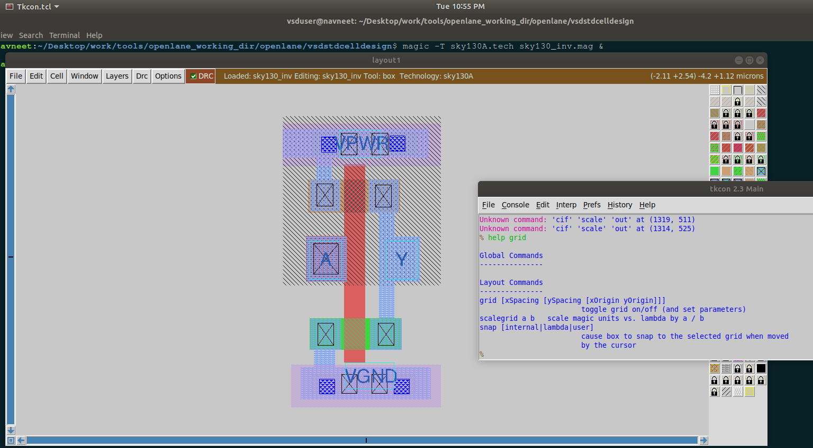
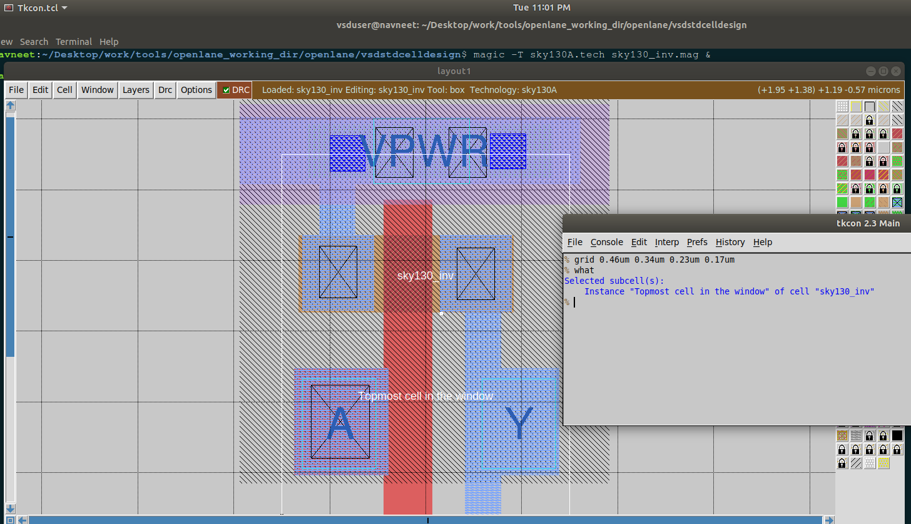
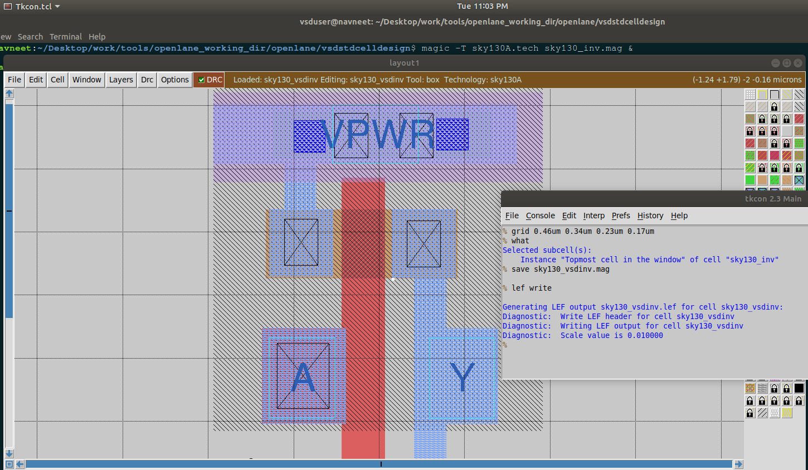
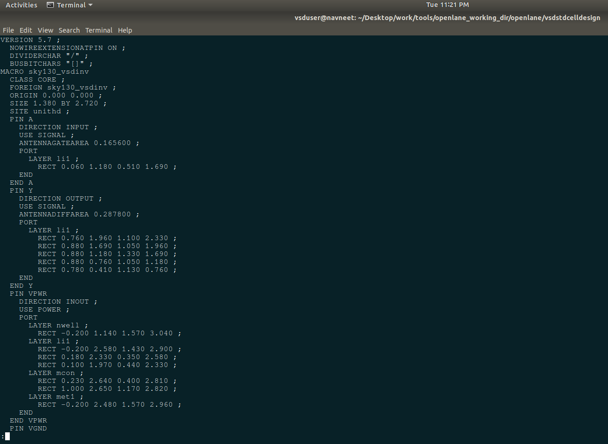
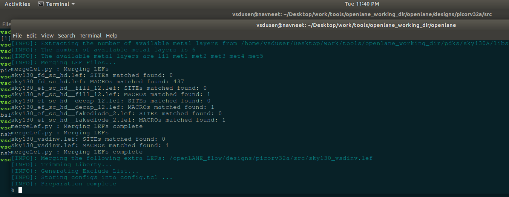

# Day 4 - Pre-layout timing analysis and importance of good clock tree

## Theory
Day 4 introduces the fundamentals of **timing analysis**, **delay modeling**, and **clock distribution** in physical design. It bridges cell-level characterization with full-chip timing closure using OpenSTA and TritonCTS.

---

### 1. Grid to Track Conversion
- **Concept:** Converts layout grids to routing tracks per metal layer for routers.  
- **Why it matters:** Ensures routers align wires correctly and meet spacing rules.  
- **Practical Notes:** Define `tracks.lef` or embed track data in tech LEF.

---

### 2. Magic Layout to Standard Cell LEF
- **Concept:** Export cell geometry and pin info into LEF format.  
- **Why it matters:** LEF guides placement and routing of cells.  
- **Practical Notes:** Use Magic `lef write` to create accurate pin boundaries.

---

### 3. Timing Libraries and Synthesis Inclusion
- **Concept:** `.lib` files define timing, power, and function arcs for synthesis and STA.  
- **Why it matters:** Ensures tools recognize new cells like `vsdinv`.  
- **Practical Notes:** Add LEF, `.lib`, and gate-level model to Yosys/abc mappings.

---

### 4. Delay Tables and Timing Arcs
- **Concept:** Two-dimensional lookup tables of delay vs input slew and output load.  
- **Why it matters:** Core of STA accuracy.  
- **Practical Notes:** STA interpolates delay for given load/slew; multiple libraries represent PVT corners.

---

### 5. Delay Table Usage (Part 1 & 2)
- **Concept:** STA computes path delays from delay tables, considering interpolation and corner data.  
- **Why it matters:** Identifies setup and hold slacks under real operating conditions.  
- **Practical Notes:** Use worst-case (slow) and best-case (fast) corners for validation.

---

### 6. Synthesis Optimization and Slack Fixing
- **Concept:** Improve timing by changing effort, clock targets, and enabling custom cells.  
- **Why it matters:** Ensures design meets timing pre-placement.  
- **Practical Notes:** Adjust synthesis constraints, enable retiming, or use faster gates.

---

### 7. Timing Analysis with OpenSTA
- **Concept:** Perform STA using timing libraries and synthesized netlist.  
- **Why it matters:** Detects setup/hold issues early.  
- **Practical Notes:** Use commands `read_liberty`, `read_verilog`, `create_clock`, `report_timing`.

---

### 8. Clock Jitter and Uncertainty
- **Concept:** Jitter = clock edge variation; uncertainty = total timing margin reduction.  
- **Why it matters:** Reduces effective clock period and affects setup margins.  
- **Practical Notes:** Use `set_clock_uncertainty` in SDC to model jitter.

---

### 9. Post-Synthesis Timing Verification
- **Concept:** Run OpenSTA on post-synth netlist with parasitics.  
- **Why it matters:** Confirms if synthesis achieved target timing.  
- **Practical Notes:** Include `.spef` and `.lib` for accurate delay analysis.

---

### 10. ECO and Setup Optimization
- **Concept:** ECO modifies the netlist to fix timing without full resynthesis.  
- **Why it matters:** Enables late-stage timing fixes.  
- **Practical Notes:** Add buffers, swap cells, or adjust paths in OpenSTA.

---

### 11. Clock Tree Synthesis (CTS) — TritonCTS
- **Concept:** Automatically builds balanced clock trees to minimize skew and delay.  
- **Why it matters:** Reliable clock distribution is critical for synchronous timing.  
- **Practical Notes:** Define root clocks, buffers, and targets; verify CTS DEF and tree structure.

---

### 12. Crosstalk and Shielding
- **Concept:** Crosstalk causes timing errors; shielding protects clock nets.  
- **Why it matters:** Clock nets must have low noise and stable edges.  
- **Practical Notes:** Use middle metal layers and guard wires for clock routes.

---

### 13. CTS Execution and Verification
- **Concept:** Run TritonCTS and validate with post-CTS STA.  
- **Why it matters:** CTS alters insertion delay and skew; must recheck timing.  
- **Practical Notes:** Inspect buffer placement and run `report_clock -skew`.

---

### 14. Real-Clock Timing Analysis (Setup & Hold)
- **Concept:** Use actual clock tree delays for STA.  
- **Why it matters:** Post-CTS timing is more accurate than ideal-clock analysis.  
- **Practical Notes:** Run `report_timing -setup` and `-hold` using post-CTS netlist and SPEF.

---

### 15. Buffer Impact on Timing
- **Concept:** Larger CTS buffers change skew, latency, and setup/hold behavior.  
- **Why it matters:** Demonstrates timing-power tradeoff in clock design.  
- **Practical Notes:** Analyze slack variation with buffer sizing sweeps.

---

## Labs

In the console window of `magic`, enter the following command to access information about the **grid** feature:

```bash
help grid
```



---

Port Class and Use Configuration

The command

```bash
grid 0.46um 0.34um 0.23um 0.17um
what
```

defines the **layout grid parameters** in Magic, specifying grid spacing and offsets for accurate alignment of layout features.



---

Then, in the `magic` console

```bash
save sky130_vsdinv.mag
lef write
```



---

**Viewing the Generated LEF File**
To open and inspect the LEF file, use the following commands:

```bash
cd vsdstdcelldesign
less sky130_vsdinv.lef
```

**Opening the LEF File**
This allows you to review the exported layout information such as cell boundaries, pins, and layer details.



---

**Copying the LEF File**
Use the following command to move the generated LEF file into the design source directory:

```bash
cp sky130_vsdinv.lef ~/Desktop/work/tools/openlane_working_dir/openlane/designs/picorv32a/src/
```

---

**Configuration File Updates**

The following configuration settings define the design environment, timing parameters, and library paths for synthesis and analysis:

```tcl
# Design Information
set ::env(DESIGN_NAME) "picorv32a"

# Source Files
set ::env(VERILOG_FILES) "./designs/picorv32a/src/picorv32a.v"
set ::env(SDC_FILE) "./designs/picorv32a/src/picorv32a.sdc"

# Clock Configuration
set ::env(CLOCK_PERIOD) "5.000"
set ::env(CLOCK_PORT) "clk"
set ::env(CLOCK_NET) $::env(CLOCK_PORT)

# Library Paths
set ::env(LIB_SYNTH) "$::env(OPENLANE_ROOT)/designs/picorv32a/src/sky130_fd_sc_hd__typical.lib"
set ::env(LIB_FASTEST) "$::env(OPENLANE_ROOT)/designs/picorv32a/src/sky130_fd_sc_hd__fast.lib"
set ::env(LIB_SLOWEST) "$::env(OPENLANE_ROOT)/designs/picorv32a/src/sky130_fd_sc_hd__slow.lib"
set ::env(LIB_TYPICAL) "$::env(OPENLANE_ROOT)/designs/picorv32a/src/sky130_fd_sc_hd__typical.lib"

# Additional LEF Files
set ::env(EXTRA_LEFS) [glob $::env(OPENLANE_ROOT)/designs/$::env(DESIGN_NAME)/src/*.lef]

# Conditional Configuration Load
set filename $::env(OPENLANE_ROOT)/designs/$::env(DESIGN_NAME)/$::env(PDK)_$::env(STD_CELL_LIBRARY)_config.tcl
if { [file exists $filename] == 1 } {
    source $filename
}
```

**Preparation Command**

Execute the following commands to initialize the design environment and load the updated configuration:

```bash
package require openlane 0.9
prep -design picorv32a -overwrite
```

💡 **Note:** The `-overwrite` flag ensures that the latest parameter values from the updated `config.tcl` file are applied.




---

Then, run synthesis, floorplan, and placement and routing.

```bash
run_synthesis
init_floorplan
place_io
tap_decap_or
run_placement
```


---