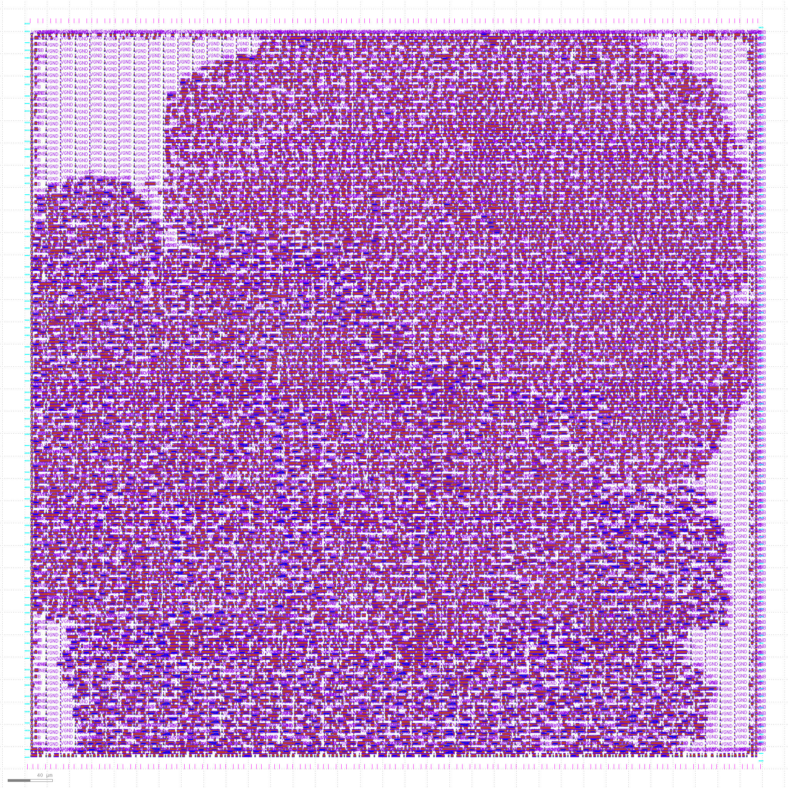
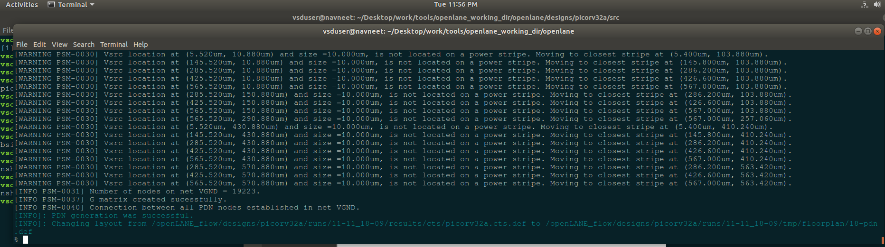
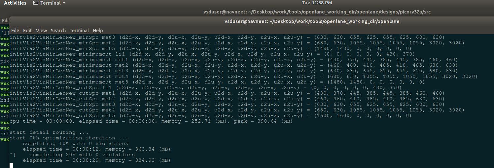
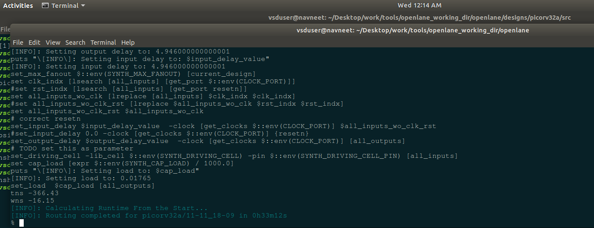
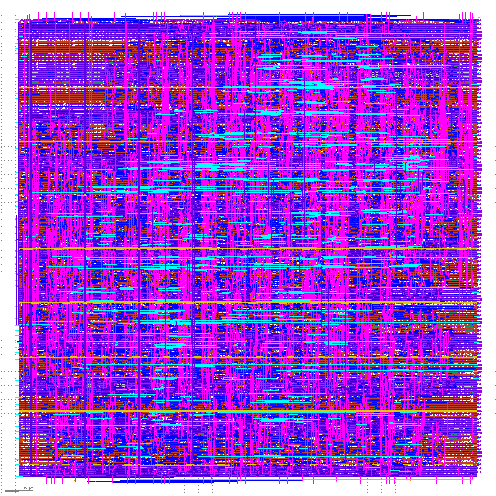

# Day 5 - Final steps for RTL2GDS using tritonRoute and openSTA

## Theory

This session focused on the routing and verification stages of the physical design flow, emphasizing how signals and power are connected on-chip and validated before tapeout.

### Maze Routing (Lee’s Algorithm)
Lee’s algorithm was introduced as a grid-based shortest-path routing method using breadth-first search. It guarantees a valid route if one exists but is computationally expensive. Modern tools improve upon it using heuristics and rip-up & reroute methods for scalability.

### Design Rule Check (DRC)
DRC ensures the layout adheres to manufacturing rules like spacing, width, and overlap constraints. Passing DRC is mandatory before tapeout. Tools like Magic or KLayout are used to visualize and fix violations.

### Power Distribution Network (PDN)
The PDN lab covered building power straps, rings, and connections from global rails down to standard-cell power pins. This ensures uniform power delivery, low IR-drop, and robust connectivity. Proper via placement and wide metal layers are critical for reliability.

### Routing – Global and Detailed
Global routing determines coarse routing paths per net and metal layer, while detailed routing assigns exact tracks and vias. TritonRoute performs detailed routing using guides and rules from the technology LEF to produce final layouts that obey all constraints.

### TritonRoute Features
TritonRoute supports:
- **Guide-based routing:** Follows pre-generated route guides from global routing.
- **Multi-layer connectivity:** Handles via insertions and inter-layer routing while maintaining design rules.
- **Conflict resolution:** Uses rip-up and reroute strategies to solve congestion and ensure all nets connect properly.

### Post-Routing Outputs
After routing, key outputs include:
- `final.def`, `final.gds` – physical layout files  
- `final.spef` – extracted parasitics for STA  
- `route.rpt` and `drc.rpt` – routing and DRC reports  

These outputs form the basis for signoff checks like LVS, DRC, and final timing verification.

---

## Labs

Finally, after CTS, PDN and routing, using 

```bash
run_cts
```


```bash
gen_pdn
```



```bash
run_routing
```




---

After the routing stage is completed, the complete physical layout of the chip is presented, ready for fabrication.

The GDS file includes all standard cells, interconnections, power networks, and routing layers integrated together.

📸 **Final GDS Layout Output**


---